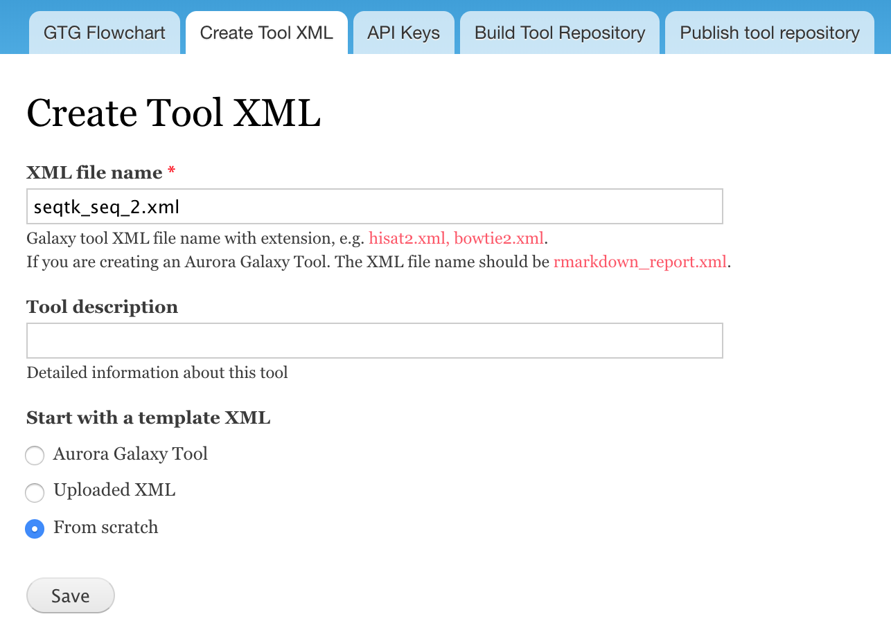
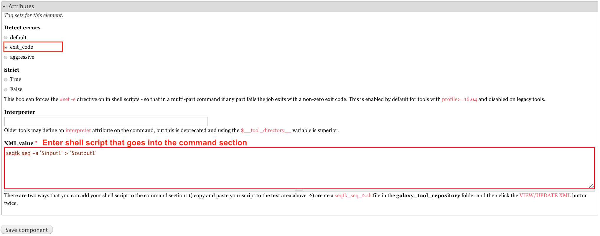
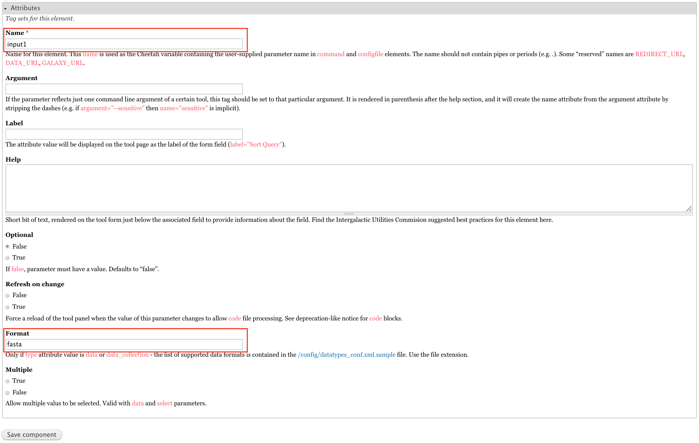

# Docker Galaxy Tool Generator

This docker image can be used to launch a Galaxy Tool Generator (GTG) for developing Galaxy
tools through web interfaces.


 
To get necessary docker images:

```
docker pull mingchen0919/gtgdocker
docker pull bgruening/galaxy-stable:17.09
```

## Launch GTG

```
wget https://raw.githubusercontent.com/MingChen0919/gtgdocker/master/launch_dev_env.sh
sh launch_dev_env.sh
```

This script will launch a docker container running the GTG app and another container running
a Galaxy instance. Login to the Galaxy instance with username **admin** and password **admin**
so that you can install tools from tool shed.

After running this script, you should see the following directories in your current directory:

```
gtg_dev_dir/
├── database
├── galaxy_tool_repository
└── shed_tools
```

## Build Tool XML

GTG provides three ways to build a Galaxy XML file:

* Aurora Galaxy Tool: this option starts with an template file for developing an Aurora Galaxy Tool.
* Uploaded XML: starts with an uploaded XML.
* From scratch: builds XML from scratch.


### Start from scratch

In this example we are going to use GTG to build this [seqtk_seq_2.xml](https://raw.githubusercontent.com/MingChen0919/gtgdocker/master/seqtk_seq_2.xml) file.


0. Initialize an XML

* Click **Create Tool XML**
* Enter `seqtk_seq_2.xml` into **XML file name**
* Select **From scratch** and click **Save**




1. Create **tool** component, which is the root component.

```
<tool id="seqtk_seq" name="Convert to FASTA (seqtk)" version="0.1.0">
```


Edit tool component attributes


2. Create **tool->requirements** component.

```
<requirements>
        <requirement type="package" version="1.2">seqtk</requirement>
</requirements>
```

Add **tool->requirements** component


Edit **tool->requirements** component attributes. However, this component does not have any attributes.


Add **tool->requirements->requirement** component


Edit **tool->requirements->requirement** component attributes.


3. Create **tool->command** component

```
    <command detect_errors="exit_code"><![CDATA[
        seqtk seq -a '$input1' > '$output1'
    ]]></command>
```

Add **tool->command** component


Edit **tool->command** component attributes.



The **XML value** field in the above web form is used to collect the shell script for the command section. However,
there is an easier way to input shell script into the tool XML file. Go to the **gtg_dev_dir/galaxy_tool_repository** and create 
a `.sh` file. Put the shell script into this file, the content will be automatically integrated into the web form field when the XML webform page is being viewed (see the image below). The `.sh` file should have exact the same base name as the XML file. For example, in this example, the XML file is `seqtk_seq_2.xml`, then the `.sh` file should be `seqtk_seq_2.xml`. 


4. Create **tool->inputs** component

```
    <inputs>
        <param type="data" name="input1" format="fastq" />
    </inputs>
```

Add **tool->inputs** component


Edit **tool->inputs** component attributes

In this example, we don't need to edit any attributes for this component.


Add **tool->inputs->param(type: data)** component


Edit **tool->inputs->param(type: data)** component attributes



5. Create **tool->outputs** component

```
    <outputs>
        <data name="output1" format="fasta" />
    </outputs>
```


