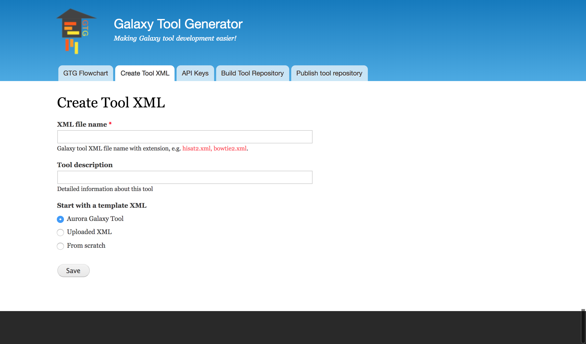
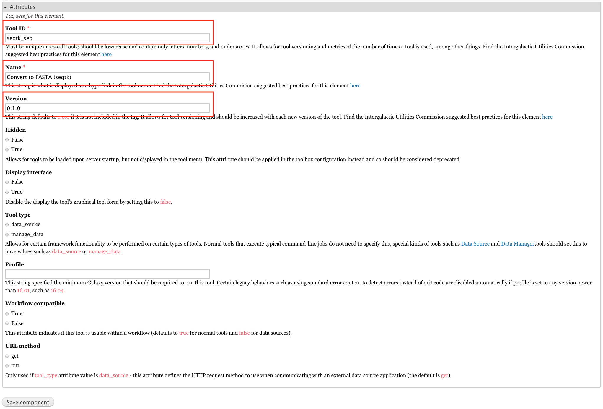
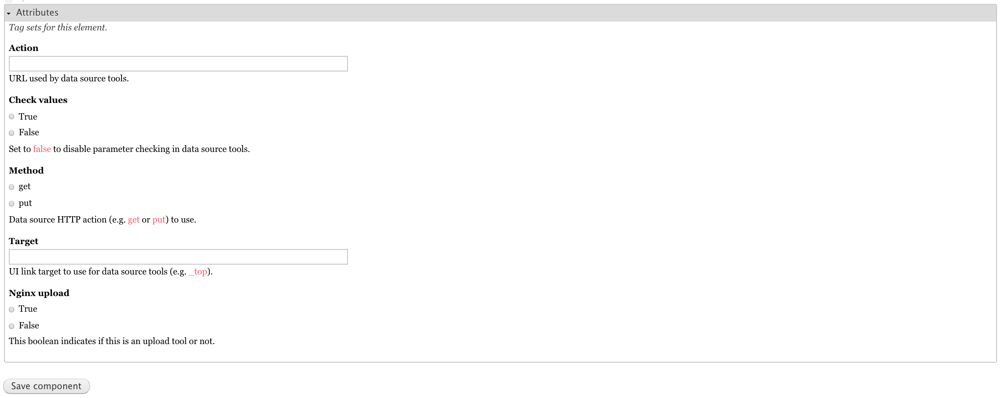
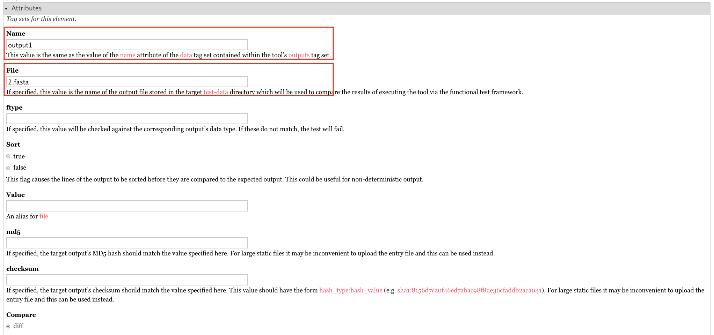
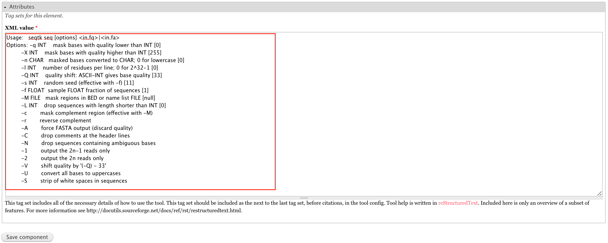
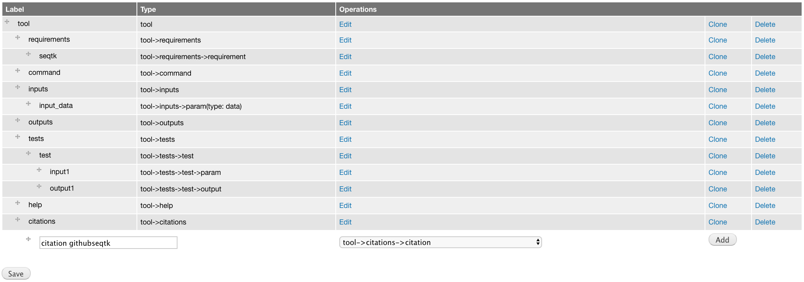
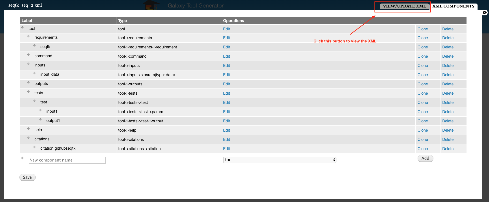
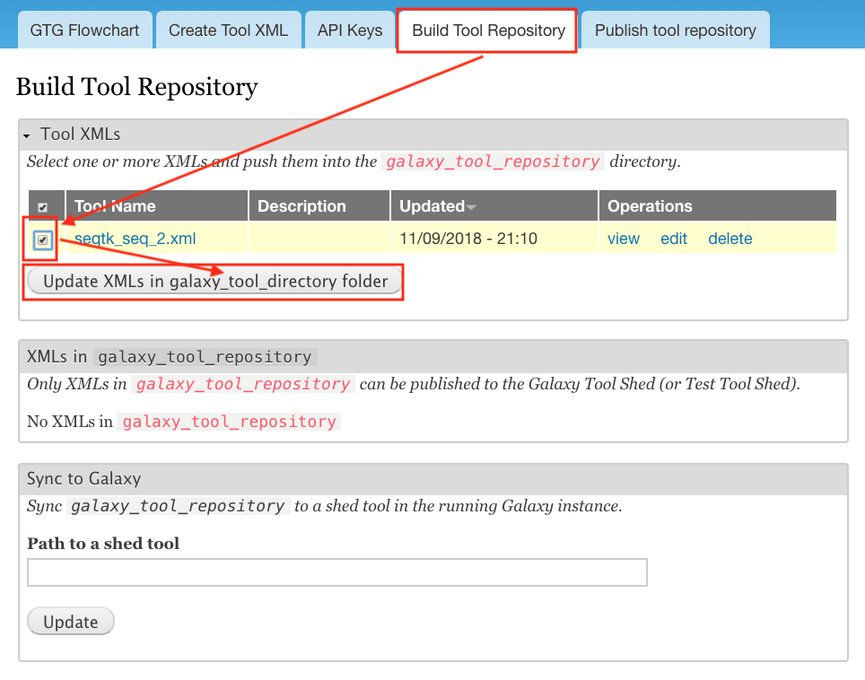
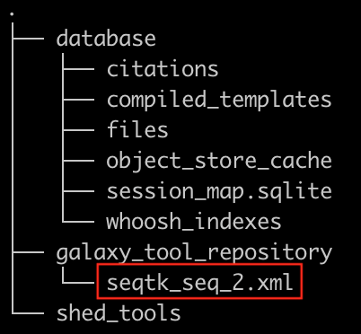

# Galaxy Tool Generator (GTG)

GTG is a [Drupal](https://www.drupal.org/) based web application which enables developing and publishing 
Galaxy tools through web interfaces. It web application consists of two Drupal modules: [galaxy_tool_generator_ui](https://github.com/MingChen0919/galaxy_tool_generator_ui) and [galaxy_tool_generator](https://github.com/MingChen0919/galaxy_tool_generator_ui), and
depends on the Drupal [webform](https://www.drupal.org/project/webform) module.


# Docker Galaxy Tool Generator

This repository builds a Docker image that can be used to quickly launch the GTG web application for Galaxy tool development.

 
To get necessary docker images:

```
docker pull mingchen0919/gtgdocker
docker pull bgruening/galaxy-stable:17.09
```

## Launch GTG

```
wget https://raw.githubusercontent.com/MingChen0919/gtgdocker/master/launch_dev_env.sh
sh launch_dev_env.sh
```

This script will launch a docker container running the GTG app and another container running
a Galaxy instance. Login to the Galaxy instance with username **admin** and password **admin**
so that you can install tools from tool shed.

After running this script, you should see the following directories in your current directory:

```
gtg_dev_dir/
├── database
├── galaxy_tool_repository
└── shed_tools
```

## Build Tool XML

GTG provides three ways to build a Galaxy XML file:

* Aurora Galaxy Tool: this option starts with an template file for developing an Aurora Galaxy Tool.
* Uploaded XML: starts with an uploaded XML.
* From scratch: builds XML from scratch.



### Start from scratch

For comparison with another software for Galaxy tool development [**planemo**](https://planemo.readthedocs.io/en/latest/), I am going to use [an example](https://planemo.readthedocs.io/en/latest/writing_standalone.html) from the planemo use cases. In this example we are going to use GTG to build this [seqtk_seq_2.xml](https://raw.githubusercontent.com/MingChen0919/gtgdocker/master/seqtk_seq_2.xml) file.


#### 0. Initialize an XML

* Click **Create Tool XML**
* Enter `seqtk_seq_2.xml` into **XML file name**
* Select **From scratch** and click **Save**


#### 1. Create **tool** component, which is the root component.

```
<tool id="seqtk_seq" name="Convert to FASTA (seqtk)" version="0.1.0">
```


Edit tool component attributes




#### 2. Create **tool->requirements** component.

```
<requirements>
        <requirement type="package" version="1.2">seqtk</requirement>
</requirements>
```

Add **tool->requirements** component


Edit **tool->requirements** component attributes. However, this component does not have any attributes.


Add **tool->requirements->requirement** component


Edit **tool->requirements->requirement** component attributes.


#### 3. Create **tool->command** component

```
    <command detect_errors="exit_code"><![CDATA[
        seqtk seq -a '$input1' > '$output1'
    ]]></command>
```

Add **tool->command** component


Edit **tool->command** component attributes.


The **XML value** field in the above web form is used to collect the shell script for the command section. However,
there is an easier way to input shell script into the tool XML file. Go to the **gtg_dev_dir/galaxy_tool_repository** and create 
a `.sh` file. Put the shell script into this file, the content will be automatically integrated into the web form field when the XML webform page is being viewed (see the image below). The `.sh` file should have exact the same base name as the XML file. For example, in this example, the XML file is `seqtk_seq_2.xml`, then the `.sh` file should be `seqtk_seq_2.xml`. 


#### 4. Create **tool->inputs** component

```
    <inputs>
        <param type="data" name="input1" format="fastq" />
    </inputs>
```

Add **tool->inputs** component


Edit **tool->inputs** component attributes

In this example, we don't need to edit any attributes for this component.



Add **tool->inputs->param(type: data)** component


Edit **tool->inputs->param(type: data)** component attributes


#### 5. Create **tool->outputs** component

```
    <outputs>
        <data name="output1" format="fasta" />
    </outputs>
```

Add **tool->outputs** component


Edit **tool->outputs** component attributes

In this example, we don't need to edit any attributes for this component.


#### 6. Create **tool->tests** component

```
    <tests>
        <test>
            <param name="input1" value="2.fastq"/>
            <output name="output1" file="2.fasta"/>
        </test>
    </tests>
```

Add **tool->tests** component


Edit **tool->tests** component attributes

This component does not have attributes


Add **tool->tests->test** component


Edit **tool->tests->test** component attributes

This component does not have attributes


Add **tool->tests->test->param** component


Edit **tool->tests->test->param** component attributes


Add **tool->tests->test-output** component


Edit **tool->tests->test-output** component attributes




#### 7. Create **tool->help** component

```
    <help><![CDATA[
        
Usage:   seqtk seq [options] <in.fq>|<in.fa>
Options: -q INT    mask bases with quality lower than INT [0]
         -X INT    mask bases with quality higher than INT [255]
         -n CHAR   masked bases converted to CHAR; 0 for lowercase [0]
         -l INT    number of residues per line; 0 for 2^32-1 [0]
         -Q INT    quality shift: ASCII-INT gives base quality [33]
         -s INT    random seed (effective with -f) [11]
         -f FLOAT  sample FLOAT fraction of sequences [1]
         -M FILE   mask regions in BED or name list FILE [null]
         -L INT    drop sequences with length shorter than INT [0]
         -c        mask complement region (effective with -M)
         -r        reverse complement
         -A        force FASTA output (discard quality)
         -C        drop comments at the header lines
         -N        drop sequences containing ambiguous bases
         -1        output the 2n-1 reads only
         -2        output the 2n reads only
         -V        shift quality by '(-Q) - 33'
         -U        convert all bases to uppercases
         -S        strip of white spaces in sequences
    ]]></help>
```

Add **tool->help** component


Edit **tool->help** component attributes




#### 8. Create **tool->citations** component

```
<citations>
        <citation type="bibtex">
@misc{githubseqtk,
  author = {LastTODO, FirstTODO},
  year = {TODO},
  title = {seqtk},
  publisher = {GitHub},
  journal = {GitHub repository},
  url = {https://github.com/lh3/seqtk},
}</citation>
    </citations>
```

Add **tool->citations** component


Edit **tool->citations** component attributes

This component does not have attributes


Add **tool->citations->citation** component



Edit **tool->citations->citation** component attributes


#### 9. View the complete XML file

Now you have created all the components for building the [seqtk_seq_2.xml](https://raw.githubusercontent.com/MingChen0919/gtgdocker/master/seqtk_seq_2.xml) file, you can view the XML page to see how it look like on GTG. Of course, you can view the XML page
any time you want. It doesn't have to be after you have added all the components.



Below is the XML page.


### Build tool repository

You have just created the `seqtk_seq_2.xml` file in GTG. However, this file is not in the `gtg_dev_dir/galaxy_tool_repository` directory yet.
We need to the XML file into it, and any other non-XML files if there is any.

Click the **Build Tool Repository** tab and select any XML files that you want to add to the `gtg_dev_dir/galaxy_tool_repository` directory. And then click the `Update XMLs in galaxy_tool_directory folder`. **This is also the button that you use to add an updated XML to the directory**.



You should be able to see the `seqtk_seq_2.xml` file in the `gtg_dev_dir` directory.




### Add non-XML files


